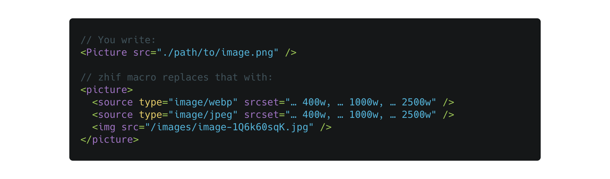

<div align="center">
  <h1>zhif</h1>
  <p>Babel macros and React components for dealing with images in a React application</p>
  
</div>

# Goal

The goal of this set of Babel macros and React components is to make it easier to replace your `` tags with `<picture>` (or if `<picture>` doesn't fit your constraints, to make it easier to build something equivalent yourself). What's so great about `<picture>`? It can take advantage of next-gen image formats (JPEG2000, WebP, HEIF). Combine that with the `` attributes `srcset` and `sizes`, and you can minimize the bandwidth that your image assets require (therefore speed up the website, and increase your lighthouse score).

In addition to that, the package aims to:

 - Provide good TypeScript support (ie. display type errors or warnings when you misuse the macros)
 - Require no or very little configuration for common use cases.
 - Be fast enough (thanks to caching and use of async code) that there is no need to disable it during development.

Caveats:

 - Only next.js apps are supported. Support may be extended to all webpack projects in the future through additional configuration options.

# Installation

The code is not yet available as a package on NPM. But it's just one file, so just copy it into your project and be done.

 1. [Enable babel macros in your project](https://github.com/kentcdodds/babel-plugin-macros/blob/master/other/docs/user.md)
 2. Install the zhif macro and its peer dependencies: `npm install --save-dev @zhif/macro sharp`

# Example

You write:

```
import { Picture } from "@zhif/macro"
<Picture src="./path/to/image.png" />
```

Out comes:

```
<picture>
  <source type="image/webp" srcset="… 400w, … 1000w, … 2500w" />
  <source type="image/jpeg" srcset="… 400w, … 1000w, … 2500w" />
  
</picture>
```

A couple things to note here:

 - The macro **replaces** the `<Picture>` component with the HTML `<picture>` element. No React component is used at runtime, it's as if you wrote the `<picture>…</picture>` code yourself.
 - The macro **converts** and **resizes** the image to generate multiple formats and sizes. It'll pick the appropriate next-gen image formats, use reasonable defaults for image widths. The generated images are placed into the `./public/images/…` folder.
 - This transformation happens enterily in Babel, no additional configuration (eg. webpack loaders) is required.

# API

### `<Picture>`

Use this to replace your `` elements. This is the most basic API.

```
import { Picture } from "@zhif/macro"
<Picture src="./path/to/image.png" />
```

### `importImage()`

This performs essentially the same operations as `<Picture>`, but instead of replacing your code with the `<picture>` element, it'll return a JavaScript object which contains all the information that you can use in your own component.

```
import { importImage } from "@zhif/macro"
const meta = importImage("./path/to/image.png")
```

```
{
  metadata: { width: 4368, height: 2912 },
  img: { src: '/images/image-xx.jpg' },
  sources: [
     { srcSet: '…', type: 'image/webp' },
     { srcSet: '…', type: 'image/jpeg' }
  ]
}
```

# TODO

 - [x] Publish as package on NPM
